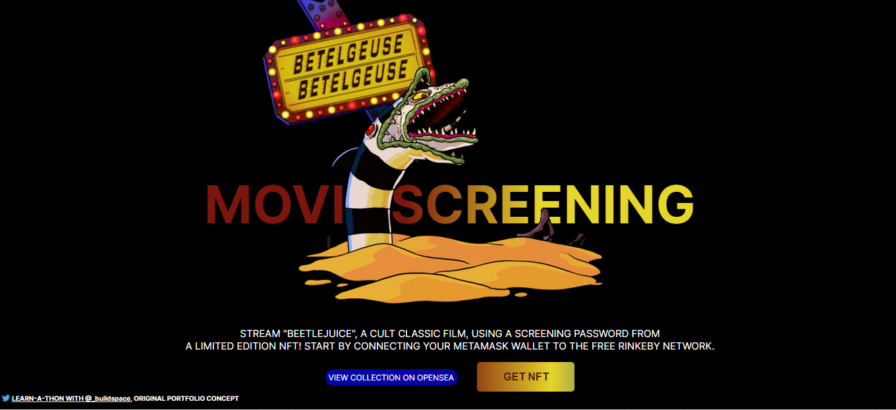

# NFT APP

This is a [Buildspace](https://buildspace.so/) project.

# ABOUT

During a two-week sprint, I coded and deployed an Ethereum smart contract with an accompanying NFT collection and interactive web app using Solidity and React amongst 400+ developers. As a Buildspace learn-a-thon, there was a live "kick-off" showcasing an intro to the project scope. There were scheduled, hour-long coworking sessions where lo-fi beats played as we indivdually worked alongside the developer community.

# USE CASE

For my project, I advertised a faux film screening of Beetlejuice. Users can mint an NFT for a virtual screening password by connecting their Metamask wallet to the free Rinkeby testnet. They will own their NFT and can re-sell their NFT on the Opensea marketplace.

# HELPFUL TERMS

1. __Smart Contract__: a piece of code that lives on the blockchain
2. __Blockchain__: a public place where anyone can securely read and write data for a fee
3. __Metamask Wallet__: a crypto wallet & secure gateway to connect blockchain apps
4. __Rinkeby Testnet__: a free Ethereum test network
5. __NFT__: a data "token" that a person can own
6. __Mint__: publicly publishing to the blockchain
7. __Opensea Marketplace__: a peer-to-peer marketplace to buy, sell, and auction NFTs

# INSTALL REQUIREMENTS

1. _Install_ node/npm
2. _Install_ Hardhat
3. _Install_ Hardhat Dependencies: Waffle & Ethers
4. _Install_ Metamask Browser Extension

# NFT DESIGNS

I created the NFT designs using SVG. The club passes are character spoilers paired with random colors.

       

# NFT CERTIFICATE

I earned an NFT for completing the learn-a-thon challenge within the 2-week sprint.

