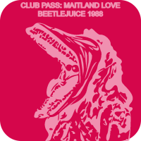

# NFT APP

This is a [Buildspace](https://buildspace.so/) project. 

During a 2-week learn-a-thon, I wrote an Ethereum smart contract using Solidity, 
programmatically generated my own NFT collection, and created a React dApp 
allowing users to mint the NFT collection. To view the app, visit https://movie-screening-nft.scarlett-spade.repl.co/.
  

# NFT DESIGNS
       

I created the NFT designs using SVG. The club passes are character spoilers paired with random colors.

# NFT CERTIFICATE

I received an NFT for completing the learn-a-thon challenge within the 2-week sprint.
